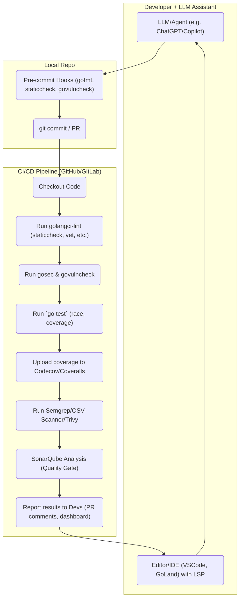
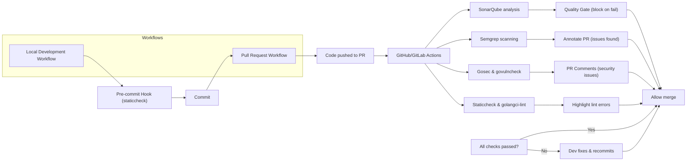

# Executive Summary  
AI-assisted Go development demands robust tooling to ensure code quality, security, and visibility.  This report surveys top open-source tools (linters, analyzers, dashboards, and security scanners) that fit into Go’s CI/CD pipelines and LLM agent workflows.  We evaluate tools on license, maturity, Go support, analysis features, customizability, integrations (CI, IDE, APIs), visualization, performance, and community.  Key findings include: **GolangCI-Lint** (GPLv3) and **Staticcheck** (MIT) as core linters (fast, CI/IDE-ready); **Semgrep** (LGPL) and **SonarQube CE** (LGPL) for pattern-based code reviews with dashboards; **gosec** (Apache 2) and **govulncheck** (BSD) for security scans; plus **OSV-Scanner/Grype/Syft** for dependency/SBOM scanning. We also cover integration patterns (pre-commit hooks, PR gates with Quality Gates), CI/CD snippets (GitHub Actions/GitLab), and orchestration (Danger bots, policy engines). Tables and diagrams summarize tool features. Recommendations depend on team size and risk posture: for example, **staticcheck + govulncheck + gosec** for smaller teams, and **SonarQube + CodeQL + Semgrep** for large enterprises requiring deep analysis. Below, we detail tool comparisons, workflow architectures, sample CI configs, and pros/cons.  

# Comparison of Key Tools  

| **Tool / Category**   | **License**       | **Maturity / Community**        | **Go Support**           | **Static Analysis Features**                | **Dynamic Analysis**                 | **Rule Customization**               | **CI/CD & VCS Integration**            | **IDE/Editor Support**                       | **Visualization / Dashboard**               | **API/Automation (Agents)**                 | **Vuln/Secrets Detection**             | **Performance / Scalability**                         | **Deployment/Ease**              | **Community Activity**     |
|---------------------- |------------------ |-------------------------------- |------------------------- |---------------------------------------------|--------------------------------------|-------------------------------------|---------------------------------------|------------------------------------------------|-------------------------------------------|--------------------------------------------|---------------------------------------|-------------------------------------------------------|----------------------------------|--------------------------|
| **GolangCI-Lint**     | GPL-3.0 | Very high (19k★; 4000+ commits) | Go (100+ linters)        | Shallow/syntactic checks (unused code, style, complexity); aggregates govet, staticcheck, errcheck, etc. | None (only static)                | Highly configurable YAML (enable/disable linters) | *Strong* GitHub Action; GitLab CI; Codecov; Slack. Reports SARIF/JSON. | VSCode (Go extension integrates), GoLand, vim-go, emacs linter plugins | No native UI (outputs reports); uses CLI.  | CLI/Action, webhook; no dedicated API but can be scripted. | Basic vulns via `gosec` integration; no secret scanning | Fast (parallel linting, caching); resource use grows with linters count.  | Easy CLI/Action install (Dockerized); one command setup | Very active dev (weekly commits) |
| **Staticcheck**       | MIT    | High (8k★; 2200+ commits)     | Go (official tool)       | Deep Go-specific checks (redundant ops, API misuse, performance issues) | None (static only)                | Limited: opinionated, few toggles (mostly on/off groups) | Official GitHub Action; works in any CI (runs `staticcheck ./...`) | Integrated in Go IDEs (via `go vet` or plugin); gopls supports many checks | No native dashboard; integrates with codecov/Sonar/SARIF viewers if needed.  | CLI/Action (dominikh/staticcheck-action) | No built-in security rules (focuses on correctness & style) | Very fast (written in Go, 150+ checks). Scales to large codebases.    | Very easy (just `go install` or use action)            | Maintained by Go team; stable.             |
| **Go Vet**           | BSD-like (part of Go) | Mature (builtin)             | Go (built-in)           | Basic correctness checks (Printf formats, unreachable code, etc.) | None                          | Limited (enable/disable checks)      | Natively in `go test`; trivial CI integration | Built-in to `go` toolchain; editor support via gopls | No UI; outputs to console or CI logs.   | CLI (part of `go`); no separate API.    | No security focus; covers simple bugs | Very fast (O(size of code)).                  | Already present in Go; zero setup in Go projects.       | Core tool (no separate dev community). |
| **Revive** (successor to *golint*) | MIT | Medium (5k★, older tool) | Go (syntax/style) | Stylistic linting (naming, formatting, comments) | None | Moderately customizable rules (JSON/YAML) | Can be run in CI (via gox). No official Action. | Works with IDEs supporting golint. | No dashboard (just CLI output). | CLI; can output JSON. | No security checks. | Fast (focus on style only). | Easy `go get`; but outdated by others. | Popular before, now less (archived). |
| **Semgrep**          | LGPL-2.1 (semi-open) | High (13k★)             | Go +30+ langs         | AST pattern matching (allows custom regex or AST rules in YAML) | None (static rules)            | Very flexible (write custom rules; large rule library) | Native GitHub Action; GitLab CI; CLI; IDE extension (VSCode extension available) | VSCode plugin; IntelliJ plugin; CLI-friendly | Web dashboard (Enterprise) available; CLI outputs SARIF/JSON | CLI & REST API (for AppSec platform) | Security SAST (many rules for injections, etc.); also secrets and SCA via paid app | Fast (interprets code without compile); scales fairly well per-file, limited cross-file | Easy (pip or binary); no setup beyond rule writing. | Active project (AppSec org), community rules. |
| **SonarQube CE** (with SonarGo plugin) | LGPL-3.0 | Very high (10k+ companies) | Multi-lang (Go via plugin) | Broad code smells, complexity, style, duplication | Limited (no runtime checks) | Extensive (custom Quality Profiles, custom rules) | Jenkins/GitHub/GitLab (Actions, MR triggers); PR analysis; quality gate support | SonarLint plugin for VSCode/IntelliJ; integrated in editors | Rich web UI with dashboards, trend charts, debt, hotspots | REST API for project metadata & results; webhook support | Basic security (in community version: some patterns); more in paid editions | Resource-heavy (requires Java, DB); good for large codebases | Medium (run as server, set up DB). Docker images available | Large community; enterprise usage; periodic releases |
| **CodeQL (GitHub)**  | Proprietary (free for OSS) | High (GitHub-supported) | Multi-lang including Go | Deep semantic analysis via relational DB (control/data flow, interprocedural) | None | Very flexible (write custom queries in QL) | GitHub Actions; CLI integration (Azure DevOps) | CodeQL VSCode extension | No standalone UI (results in GitHub code scanning interface) | CLI-driven (can script queries; API via GH code scanning) | Strong SAST (SQLi, XSS, etc. via custom or default queries) | Slow; requires building DB (heavy for large projects) | Harder (install CLI, local DB); only GitHub (pr,actions) integration | Only open to GitHub platforms (requires GHAS for private) |
| **gosec (GoSec)**    | Apache-2.0 | High (8.9k★)         | Go                     | Security linting (misuse of crypto, injection, hardcoded creds, etc.) | None | Configurable: select rule severities, disable paths | GitHub Action (securego/gosec); any CI; CLI supports JSON/SARIF | Some IDE plugins call CLI. | CLI output (JSON/SARIF); can feed dashboards (e.g. Sonar) | CLI/Action; no separate API | Detects many known patterns (SQLi, XSS, crypto misuse) | Fast (Go AST/SSA based); scalable to large codebases | Easy (`go install` or Action) | Active, maintained; de facto Go security linter |
| **govulncheck**     | BSD-3-Clause | Medium (Go team, evolving) | Go                      | Dependency vulnerability scanner (uses Go vuln DB) | No (checks code imports) | No custom rules (driven by vulnerability DB) | GitHub Action (golang/govulncheck-action); CLI; easy CI script | CLI only; integrated into `go` toolchain in Go 1.20+ | No UI; outputs CVE details; can use GitHub code scanning (SARIF) | GitHub Action & CLI (cache support) | Finds known CVEs in imported modules | Very fast; low noise; only checks known CVEs | Simple (`go install` or Action) | New tool; growing adoption in Go projects |
| **OWASP Dependency-Check** | Apache-2.0 | Mature (wide language support) | Go (limited)    | Dependency vulnerability scanner (checks go.mod/ go.sum) | No | Basic (reports CVE/versions) | CLI/Action; CI integrations (Jenkins, GH, GitLab) | None (CLI output only) | Reports in HTML/JSON/XML; no UI | CLI; can integrate with GitHub code scanning (sarif) | Detects known CVEs in deps (via NVD, OSV) | Moderate (depends on DB size); slower than govulncheck for Go specifics | Medium (Java-based tool, requires JRE) | Established in enterprise; less accurate for Go than govulncheck |
| **Go Report Card**  | Apache-2.0 | Low (archived, 600★) | Go                     | Aggregates fmt, vet, golint, ineffassign, deadcode, cyclo, etc. | None | Static config; limited | Web service; CLI; GitHub Action (community) | Web interface (public site) | Provides grade and breakdown chart (web) | CLI tool (`goreportcard-cli`) | No security checks (just code hygiene) | Fast (runs multiple tools sequentially) | Easy (web or CLI); site shutting down 7/2026 | Legacy, used in open-source projects |

*Table: Comparison of key Go tools in code quality, security, and CI integration (open-source licenses, features, etc.). Citations indicate source or documentation references.*  

# Recommended Integration Architectures  

Below are two common integration patterns for Go projects with AI-assisted coding: (1) **CI/CD Pipeline with Quality Gates**, and (2) **Pre-commit/AI-Assisted Workflow**. In both, AI-generated changes are *sandboxed* by existing tools (linters, scanners) and visibility is ensured via dashboards and PR checks.



**Figure 1:** *High-level pipeline: code from Dev/AI flows through local hooks and then CI jobs, including static analysis, security scans, and dashboards. Gate checks (e.g. sonar quality gate) can block merges if issues are found.*  



**Figure 2:** *Detailed workflows: On PRs, CI runs linters (golangci-lint), security (gosec, govulncheck), and dashboards (SonarQube with Quality Gates). Issues are annotated back on the PR. Locally, pre-commit hooks run quick checks to catch errors before pushing.*  

# Sample CI/CD and Agent Automation Snippets  

## GitHub Actions Examples  

- **Static Analysis (Staticcheck)** – Simple action step using Dominik Honnef’s Action:  
  ```yaml
  - name: Run Staticcheck
    uses: dominikh/staticcheck-action@v1
    with:
      version: '2024.1.1'  # pin version
  ```
  *This runs `staticcheck ./...` on the checked-out code.*

- **GolangCI-Lint** – Use official GitHub Action:  
  ```yaml
  - name: Run golangci-lint
    uses: golangci/golangci-lint-action@v3
    with:
      version: v1.51.2
      args: --timeout 3m ./...
  ```
  *Parallel linting of multiple analyzers (configurable via `.golangci.yml`).*

- **Gosec (Security)** – From Marketplace:  
  ```yaml
  - name: Run gosec
    uses: securego/gosec@v2  # or @master for latest
    with:
      args: ./...
  ```
  *Scans code for security flaws; outputs findings to logs or SARIF.*

- **Govulncheck (Vuln Scan)** – Official action:  
  ```yaml
  - name: Run govulncheck
    uses: golang/govulncheck-action@v1
    with:
      go-version-input: 1.21.7
      go-package: ./...
      output-format: sarif
  ```
  *Checks imported modules against Go vuln DB; can fail build on new CVEs.*

- **OSV-Scanner (Dependency Vuln)** –  
  ```yaml
  - name: OSV-Scanner (Dependency Check)
    uses: google/osv-scanner-action@v2
    with:
      work-dir: .
      output-format: sarif
  ```
  *Tracks OSV-Scanner vulnerabilities on each push or PR.*

- **Semgrep (Pattern Checks)** –  
  ```yaml
  - name: Run Semgrep
    uses: returntocorp/semgrep-action@v2
    with:
      config: 'p/ci'
  ```
  *Runs Semgrep with community or custom rules (for security and style).*

- **SonarQube** – Example sonar scan step:  
  ```yaml
  - name: SonarQube Scan
    uses: SonarSource/sonarcloud-github-action@master
    with:
      projectBaseDir: .
      # set SONAR_TOKEN in secrets
      extraArgs: >
        -Dsonar.go.coverage.reportPaths=coverage.out
  ```
  *Analyzes code, pushes results to SonarQube (Cloud or self-hosted) for quality gating.*

- **Code Coverage** – e.g., upload to Codecov:  
  ```yaml
  - name: Run tests
    run: |
      go test -coverprofile=coverage.out ./...
  - name: Upload coverage to Codecov
    uses: codecov/codecov-action@v3
    with:
      files: coverage.out
      fail_ci_if_error: true
  ```

## GitLab CI Examples  

GitLab pipelines use similar tools. Sample `.gitlab-ci.yml` snippet:  

```yaml
stages:
  - lint
  - test
  - security
  - deploy

lint:
  image: golang:1.21
  stage: lint
  script:
    - go install github.com/golangci/golangci-lint/cmd/golangci-lint@latest
    - golangci-lint run ./...
    - go install honnef.co/go/tools/cmd/staticcheck@latest
    - staticcheck ./...
  only:
    - branches
  except:
    - main

test:
  stage: test
  image: golang:1.21
  script:
    - go test -race -coverprofile=coverage.out ./...
  artifacts:
    reports:
      cobertura: coverage.out

security:
  stage: security
  image: golang:1.21
  script:
    - go install github.com/securego/gosec/v2/cmd/gosec@latest
    - gosec ./...
    - go install golang.org/x/vuln/cmd/govulncheck@latest
    - govulncheck ./...
  only:
    - merge_requests

sonarqube:
  stage: security
  image: sonarsource/sonar-scanner-cli:latest
  script:
    - sonar-scanner -Dsonar.projectKey=$CI_PROJECT_PATH -Dsonar.sources=.
  only:
    - merge_requests
```

*This pipeline runs lint, tests (with coverage), security scans (gosec, govulncheck), and SonarQube. GitLab’s merge request checks can block merging if any step fails.*  

## Agent / Bot Integration  

- **Danger (Automated PR Checks)**: In GitHub Actions or GitLab, Danger can run PR-time checks. For Go, [danger-go](https://github.com/danger/golang) wraps Danger JS (MIT). A sample Dangerfile (`build/ci/dangerfile.go`):

  ```go
  import "github.com/danger/golang"
  func Run(d *danger.T, pr danger.DSL) {
      d.Warn("Running Danger-Go checks")
      d.Ensure("Staticcheck passed", func() bool {
          return pr.Comments.Contains("staticcheck") // or custom logic
      })
      if pr.ModifiedFiles.OnlyChanges("*.go") {
          d.Failure("Missing unit tests for changed code")
      }
  }
  ```
  
  *Danger injects comments or warnings into PRs based on custom logic (e.g. ensure coverage or that linters passed).*

- **Pre-commit Hooks**: Using [pre-commit.com](https://pre-commit.com/), developers can enforce quality locally. A `.pre-commit-config.yaml` might include:

  ```yaml
  repos:
    - repo: local
      hooks:
        - id: gofmt
          name: gofmt (via gofmt)
          entry: gofmt -s -w
          language: system
          files: \.go$
        - id: staticcheck
          name: staticcheck
          entry: staticcheck
          language: system
          files: \.go$
        - id: gosec
          name: gosec
          entry: gosec ./...
          language: system
          files: \.go$
  ```

  *This blocks commits with unformatted or failing code, sandboxing the LLM’s output before pushing.*  

# Pros, Cons, and Suitability  

- **GolangCI-Lint / Staticcheck**: *Pros:* Comprehensive, fast, easy CI integration. Ideal for catching common bugs and style issues. *Cons:* Superficial checks only; high noise potential if misconfigured. *Use when:* Teams want lightweight “always-on” linting. Good for all sizes; minimal security coverage (so pair with dedicated tools).

- **Semgrep**: *Pros:* Highly customizable, catches patterns (incl. security/policy) across languages. Fast, no need to compile. *Cons:* No cross-file analysis (limited context); false positives if rules too generic. *Use when:* Projects need enforcement of architecture or security patterns. Smaller teams can start simple; larger projects benefit from building robust rule libraries.

- **SonarQube**: *Pros:* Unified quality dashboard, history/trends, quality gates, multi-language projects. Good for audit/compliance. *Cons:* Heavy infrastructure, limited Go support in CE, slower for big codebases. *Use when:* Large enterprises needing centralized code-quality metrics and gating. Smaller teams may prefer cloud/SaaS alternatives or simpler tools.

- **gosec**: *Pros:* Focused on Go security flaws; easy to run in CI. *Cons:* Pattern-based, misses context; many false positives in complex code. *Use when:* Early-stage security checks. Pairs well with govulncheck and Semgrep for more depth.

- **govulncheck/OSV-Scanner**: *Pros:* Low noise, reliable detection of known vuln deps. Keeps supply-chain risks in check. *Cons:* Only known issues; no zero-days, no logic flaws detection. *Use when:* Always, for projects serious about dependency safety. Especially vital for security-sensitive projects.

- **CodeQL**: *Pros:* Deep, semantic SAST. Covers complex vulnerabilities across repo. *Cons:* Resource-heavy; steep learning curve; GitHub ecosystem only (GHAS). *Use when:* Critical security posture, available licensing, and need for custom query analysis. Overkill for small/fast-moving teams.

- **Pre-commit & PR Bots (Danger, custom)**: *Pros:* Early feedback; automation of style/security policies in PRs. *Cons:* Maintenance of rules/scripts; possible complexity. *Use when:* Teams want automated code review assistance. Scales to any size; critical for enforcing policies consistently.

- **Coverage & SBOM (Codecov, Syft, Grype)**: *Pros:* Visualize test quality; track dependencies and vulnerabilities. *Cons:* SaaS may have cost (Codecov); Syft/Grype add steps. *Use when:* Coverage>75% is desired; software supply chain policies are required (especially containerized Go apps). Important for regulated/security-focused teams.

**Team Size and Security Posture:**  
- *Small/Startups:* Lean stack: `go fmt`/`gofumpt` + staticcheck (or golangci-lint) + govulncheck + minimal CI. Focus on agility.  
- *Medium Teams:* Add Semgrep and gosec in CI, code coverage dashboards. Possibly SonarCloud or a self-hosted Sonar.  
- *Large/Enterprise:* Full suite: SonarQube CE/Enterprise, CodeQL, semgrep, staticcheck, govulncheck, pre-commit hooks, gated CI, dedicated code review bots. High security mode requires SAST (CodeQL/Semgrep) + SCA (OSV/Grype) + DAST/fuzz (Go fuzzing).

# Best-in-Class Tool Combinations & Quick Start  

1. **General Quality Combo:** *Staticcheck + GolangCI-Lint + GoFmt + Govulncheck.*  
   - **Why:** Covers standard linting, style, and dependency safety with minimal setup.  
   - **Quick Start:** `go install honnef.co/go/tools/cmd/staticcheck@latest golang.org/x/vuln/cmd/govulncheck@latest`. Add GitHub Actions for staticcheck and govulncheck (see snippets above). Use `gofmt` or `gofumpt` as pre-commit.  

2. **Security-Focused Combo:** *Semgrep + Gosec + Govulncheck + OSV-Scanner.*  
   - **Why:** Pattern-based SAST (Semgrep), specialized Go security (gosec), plus CVE checks (govulncheck/OSV). Builds defense-in-depth.  
   - **Quick Start:** Install Semgrep CLI; add a ruleset (e.g. [Semgrep Go rules](https://semgrep.dev/explore)). Use GoSec action and Govulncheck action in CI. For dependencies, use OSV-Scanner or an Action.  

3. **Enterprise Combo:** *SonarQube CE + CodeQL + GolangCI-Lint + Syft/Grype.*  
   - **Why:** Centralized dashboard (Sonar), deep analysis (CodeQL), plus basic linters and SBOM. Ideal for large codebases/multiple languages.  
   - **Quick Start:** Deploy SonarQube server or use SonarCloud; install SonarScanner and Go plugin. Enable CodeQL via GitHub Advanced Security. Run `golangci-lint` and `gosec` in pipeline for fast feedback. Use Syft in pipeline to generate SBOM (for compliance).  

4. **DevOps/GitOps Combo:** *Pre-commit Hooks + GitHub Actions (Staticcheck, Codecov, Danger).*  
   - **Why:** Fast feedback loop; enforces code standards pre-merge.  
   - **Quick Start:** Configure `.pre-commit-config.yaml` with gofmt and staticcheck hooks. Set up GitHub Actions that run tests, coverage upload, and a Danger step for custom PR checks.  

5. **Open-Source Friendly Combo:** *Go Report Card (self-hosted) + GolangCI-Lint + Coveralls.*  
   - **Why:** Quickly scores project quality for maintainers/community. Provides historical grades.  
   - **Quick Start:** Self-host goreportcard (Apache-2) if needed beyond Jul 2026, or use CLI for badge. Integrate Codecov/coveralls for coverage badges.  

Each combo can be expanded with or replaced by similar tools (e.g. Codecov↔Coveralls, Sonar↔CodeScene). The key is layering: use **formatters (gofmt)**, **linters (staticcheck/golangci)**, **security scanners (gosec/govulncheck)**, and **CI gating (actions/quality gates)** together.

# Sources  

- Official tool docs (Staticcheck, GolangCI-Lint, Semgrep, Govulncheck, Gosec, SonarQube, Syft).  
- Community benchmarks/reviews (AugmentCode 2026 review, “Write Better Go Code” (2025)).  
- Tool repos (Danger-Go, OSV-Scanner, Go Report Card, Semgrep repo).  
- GitHub Actions Marketplace/docs (Gosec Action, Govulncheck Action, OSV-Scanner Action).  

These sources provide up-to-date capabilities and guidance for integrating these open-source tools into Go AI-assisted development workflows.